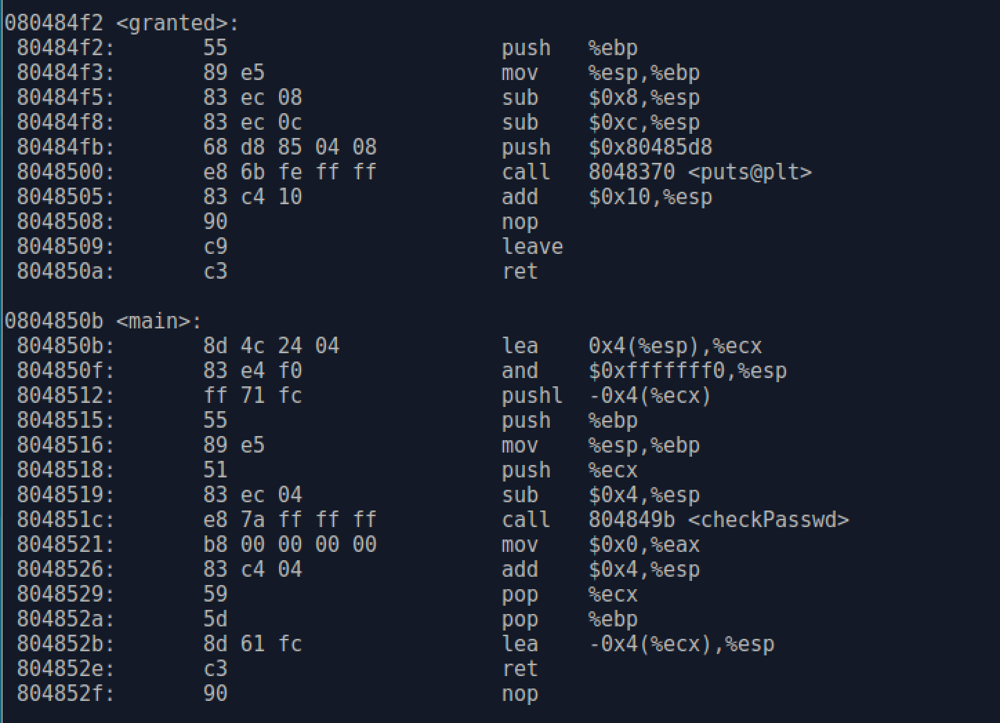

# `objdump`

The _**objdump**_ utility is similar to _**readelf**_. Again, enter `objdump --help` in the terminal prompt to view help information.

We also take _**overflow**_ executable file as example, then use _**objdump**_ to play with it. The _**objdump**_ usage format is as follows:
```
$ objdump [option] file-name
```

The following table list some common options of _**objdump**_ and corresponding description.

| options | description |
|---------|-------------|
| -a      | Display the archieve header information |
| -f      | Display the contents of the overall file header|
| -h      | Display the contents of the section headers|
| -d      | Display assembler contents of executable sections|
| -D      | Display assembler contents of all sections |
| -g      | Display debug information in object file |

So, to display the contents of the overall file header, we can take `-f` option.

```
$ objdump -f overflow
```
The information of file header printed is different from the information printed by _**readelf**_. It is much simpler. 


However, objdump can disassemble executable sections with `-d` option.

```
$ objdump -d overflow
```

Yes, just as guess, some geeks do hacking with the help of objdump then. The output is similar to what GDB `disassemble` command outputs.

