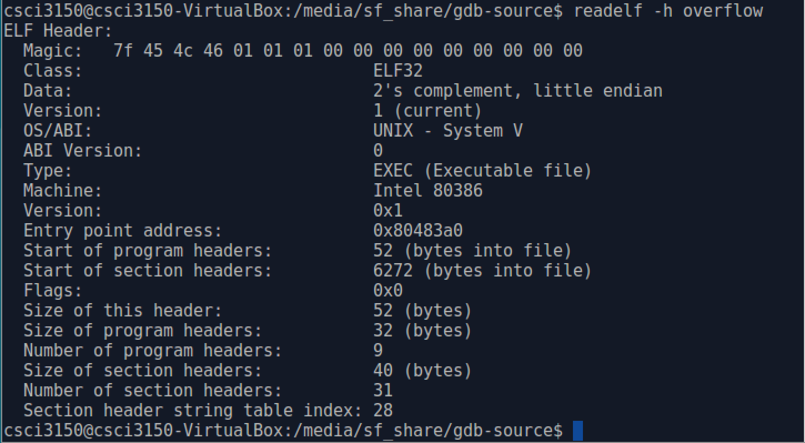
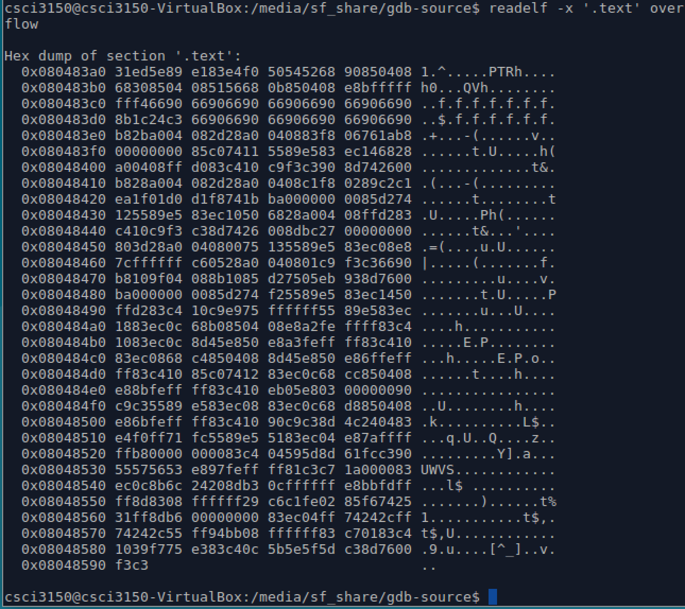

# `readelf`

At first, we can enter `readelf --help` command in the terminal prompt to show help information. 

Then we take _**overflow** executable file as example, then use _**readelf**_ to read its contents.
The _**readelf**_ usage format is as follows:

```
$ readelf [option] elf-file
```
At first we use `readlf -all overflow` to display all the information _**overflow**_ contains in a human-friendly way. 

To see a specific component like ELF file header, use command `readelf -h overflow` to display the EFL file(_**overflow**_) header. The header includes basic information describing the EFL file. For example, 'TYPE' of this ELF file is 'EXEC'(executable file), the 'Machine' is 'Intel 80386'. If you want to know more details about EFL file Header, I suggest you to read _elf.h_, whose absolute path is /usr/include/elf.h.



The following table lists some common options of _**readelf**_ and corresponding description.

| Options | Description |
| ------- | ----------- |
| -h     | Display the EFL file header|
| -l     | Display the program headers|
| -S     | Display the section headers| 
| -g     | Display the section groups |
| -t     | Display the section details|
| -s     | Display the symbol table |
| -x     | Dump the contents of section as bytes |
| -p     | Dump the contents of section as strings|

If we want to read the .text section in hex, we can take `-x` option.

```
$ readelf -x '.text' overflow
```
The .text section contains the actual machine instructions which make up your program.


