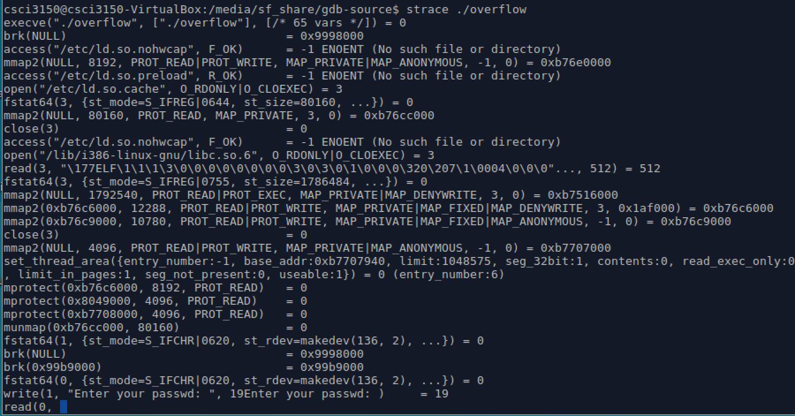

# `Strace`

Strace is quite simple a tool that traces the execution of system calls. In its simplest form it can trace the execution of a binary from start to end, and output a line of text with the name of the system call, the arguments and the return value for every system call over the lifetime of the process. But it can do a lot more.

- It can filter based on the specific system call or groups of system calls.
- It can profile the use of system calls by tallying up the number of times a specific system call is used, and the time taken, and the number of successes and errors.
- It traces sisgnals sent to process.
- It can attach to any running process by pid.

Following table lists some common options of _**strace**_. 

| option | description |
| -------| ------------|
| -i     | print instruction pointer at time of syscall|
| -o file| send trace output to FILE instead of stderr |
| -t     | print relative timestamp |
| -x     | print non-ascii strings in hex|
| -c     | count time, calls, and errors for each syscall|
| -p PID | trace process with process id PID |
| -u username | run command as username handling setuid/setgid|

Again, take _**overflow**_ as an example.

```
$ strace ./overflow
```
Each line _**strace**_ outputs contains the system call name, followed by its arguments in parentheses and its return value. For example, the first line denotes the most common system call _**execve**_. And _**strace**_ stops at a _**read**_ system call, you know,  _**overflow**_ program will ask us to enter the passwd, so here the _**read**_ wait for you entering the password.



Another functionality of _**strace**_ is that it can attach to a specific process. Ever had a process suddenly hog lots of CPU? Or had a process seem to be hanging? Then you can find the pid, and do this:

```
$ sudo strace -p 8813 
```
Here 8813 is the pid of firefox process at this time in our platform. Then we can watch system calls of this process from now on. Maybe we can find out the reason why the process takes up too much resource or it hangs, then make a decision to solve this problem.
